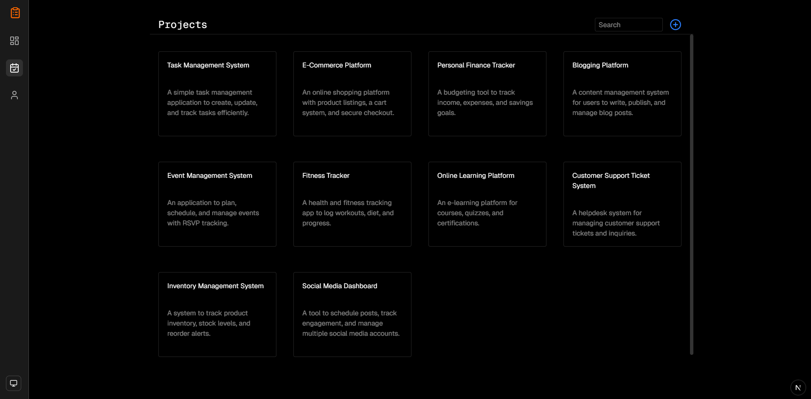

# Tasky AI - A Simple task management application with AI Powered



## 🚀 Features

- **Next.js** for server-side rendering and static site generation
- **TypeScript Integration** for type-safe code
- **Responsive Design** for optimal viewing on any device
- **Custom Fonts** powered by [next/font/google](https://nextjs.org/docs/app/building-your-application/optimizing/fonts)
- **Rich Icon Library** using `Lucide Icons, React Icons`
- **State Management** with `zustand`
- **Database** with `supabase`
- **Vercel AI-SDK**
- **API** with `Gemini API`

## 📂 Project Structure

- `app/`: Application directory
- `components/`: Reusable UI components
- `public/`: Static assets
- `Types`: Export types
- `utils`: Supabase
- `lib`: Hooks

## 🛠️ Installation

Follow these steps to get a local copy up and running:

1. **Clone the repo**
   ```sh
   git clone https://github.com/jackwaghan/Task-Management.git
   ```
2. **Install dependencies**

   ```sh
   bun install
   ```

3. **Add Keys in your `.env`**

```sh
SUPABASE_URL = ''
SUPABASE_KEY = ''

NEXT_PUBLIC_SUPABASE_URL = ''
NEXT_PUBLIC_SUPABASE_KEY = ''

DOMAIN = ''
IMAGEURL = ''
```

4. **Run the development server**
   ```sh
   bun run dev
   ```
   Visit [http://localhost:3000](http://localhost:3000) to view the site.

## 🌐 Live Demo

Check out the live version of this portfolio [here](https://tasky.jackwaghan.com/).

## 🤝 Contributing

Contributions are what make the open-source community such an amazing place to learn, inspire, and create. Any contributions you make are **greatly appreciated**.

1. Fork the Project
2. Create your Feature Branch (`git checkout -b feature/AmazingFeature`)
3. Commit your Changes (`git commit -m 'Add some AmazingFeature'`)
4. Push to the Branch (`git push origin feature/AmazingFeature`)
5. Open a Pull Request

## 📜 License

Distributed under the MIT License. See `LICENSE` for more information.
